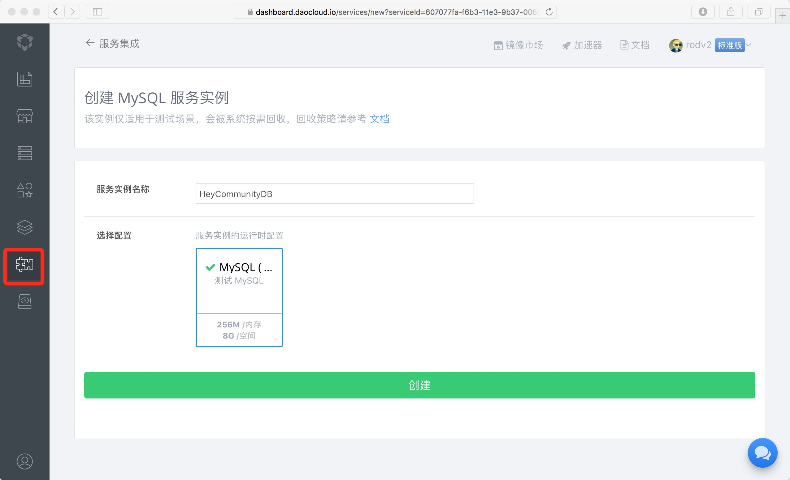
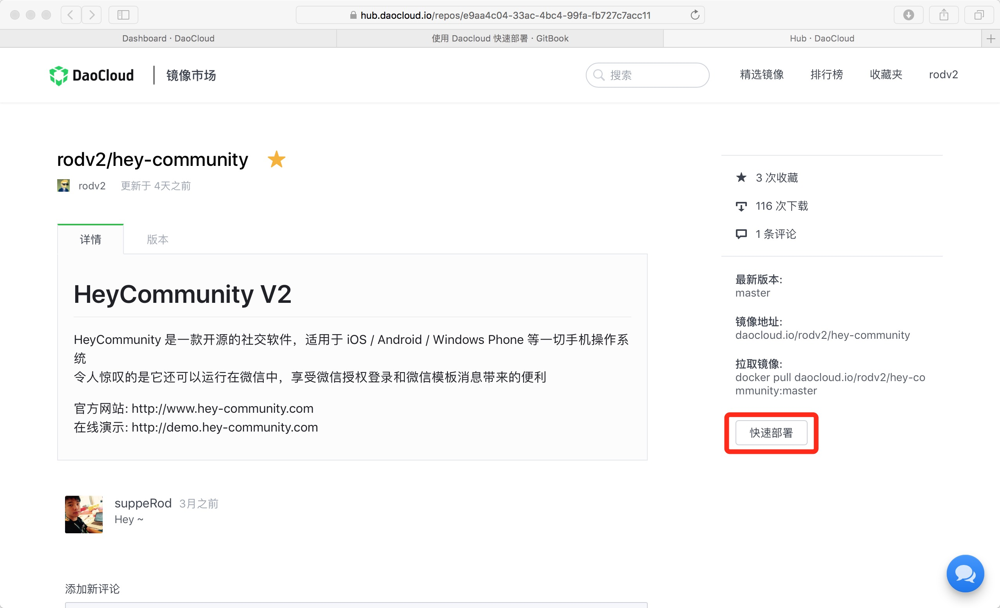
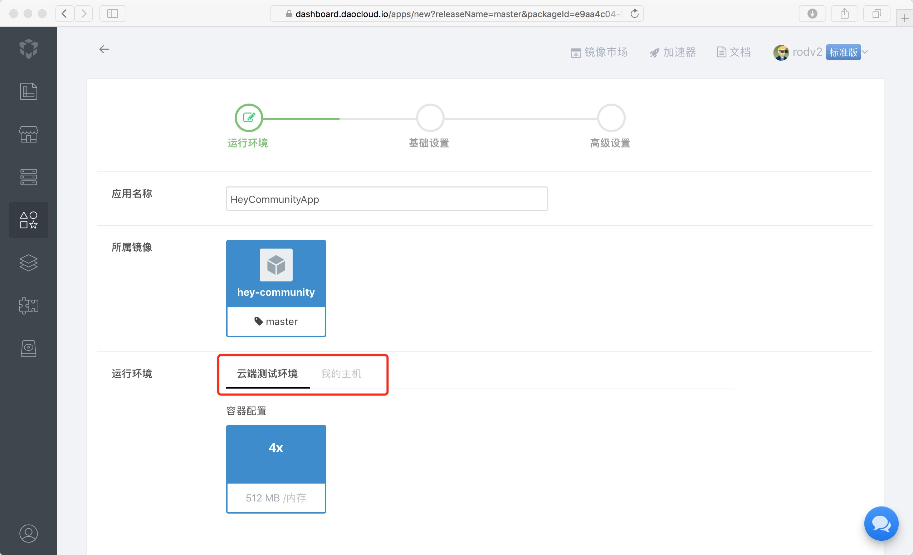
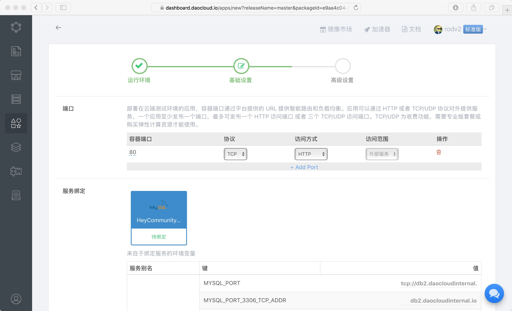
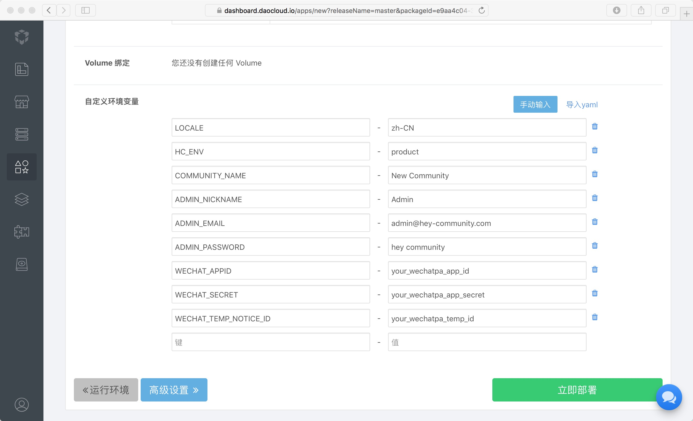
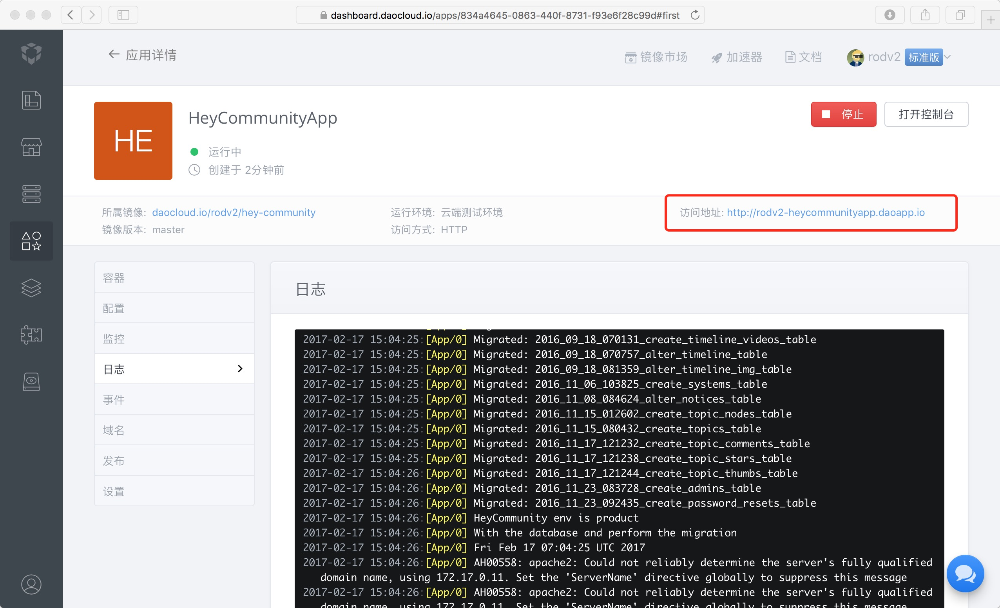

# Daocloud 快速部署

DaoCloud 是新一代容器云计算领域的明星企业，现在我们使用 DaoCloud 快速部署 HeyCommunity

进入 [DaoCloud](https://www.daocloud.io)，注册帐号并登录后，跟随我们按照如下步骤一步步操作   


## 创建 MySQL 服务

进入服务集成栏目，创建一个 MySQL 服务




## 部署 HeyCommunity

进入 [HeyCommunity](https://hub.daocloud.io/repos/e9aa4c04-33ac-4bc4-99fa-fb727c7acc11) 镜像页面，点击右侧边栏底部的【快速部署】按钮进入项目部署页面




### 运行环境



运行环境可选择 [云端测试环境] 用于测试   
运行在 [我的主机] 中对于 HeyCommunity 来说也不适合用于生产，生产请使用 DaoCloud 的应用编排功能，Docker Compose YML 可参考[使用 Docker 部署](/started/docker.html)


### 基础设置

我们在之前创建的 MySQL 服务，在这一步骤我们使其和 HeyCommunitApp 相绑定



自定义环境变量可参考如下，如无需修改可不设定环境变量
```
- LOCALE=zh-CN
- HC_ENV=product
- COMMUNITY_NAME=New Community
- ADMIN_NICKNAME=Admin
- ADMIN_EMAIL=admin@hey-community.com
- ADMIN_PASSWORD=hey community
- WECHAT_APPID=your_wechatpa_app_id
- WECHAT_SECRET=your_wechatpa_app_secret
- WECHAT_TEMP_NOTICE_ID=your_wechatpa_temp_id
```



点击[立即部署]进行部署，会跳转到应用详情页面


## 应用详情

部署可能需要一分钟左右的时间，部署成功之后可以得到一个访问地址，通过这个地址即可打开 HeyCommunity Web App   

如果部署失败，可以结合日志进行错误排查



现在，我们就通过 DaoCloud 把应用部署起来了 ~   
另外，你也可以使用 DaoCloud 的应用编排功能，部署 HeyCommunity 用于生产，详见 [使用 Docker 部署](/started/docker.html)

