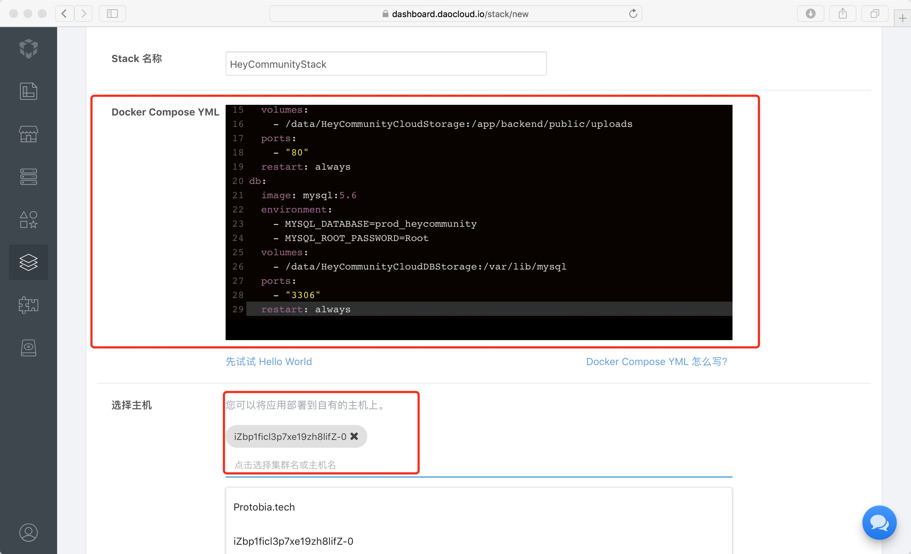
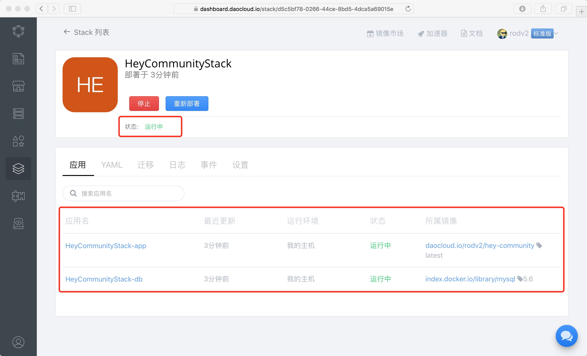

# Docker 部署

我们把 HeyCommunity 运行所需要的基础环境、程序代码等一切东西，打包成一个 Docker Image，使你仅通过几个简单几个步骤就可以把项目部署起来   

HeyCommunity 需要一个提供 Web Service 的容器和一个运行 Mysql 的容器，还有一个 Volume 进行文件的持久化。使用 Docker Compose 仅仅几行编排代码就可以实现 HeyCommunity 的部署   

其编排代码如下，你也可以在项目的 `HeyCommunity/docker-compose.yml` 文件中获取到最新的编排代码。你也可以通过修改 `environment` 自定义 HeyCommunity   

```
app:
  image: daocloud.io/rodv2/hey-community:latest
  environment:
    - LOCALE=zh-CN
    - HC_ENV=test
    - COMMUNITY_NAME=New Community
    - ADMIN_NICKNAME=Admin
    - ADMIN_EMAIL=admin@hey-community.com
    - ADMIN_PASSWORD=hey community
    - WECHAT_APPID=your_wechatpa_app_id
    - WECHAT_SECRET=your_wechatpa_app_secret
    - WECHAT_TEMP_NOTICE_ID=your_wechatpa_temp_id
  links:
    - db:MYSQL
  volumes:
    - /data/HeyCommunityCloudStorage:/app/backend/public/uploads
  ports:
    - "80"
  restart: always
db:
  image: mysql:5.6
  environment:
    - MYSQL_DATABASE=prod_heycommunity
    - MYSQL_ROOT_PASSWORD=Root
  volumes:
    - /data/HeyCommunityCloudDBStorage:/var/lib/mysql
  ports:
    - "3306"
  restart: always
```

如果你想要手动进行项目编排，请自行查阅 `Docker Compose` 相关资料   
我们建议你使用 DaoCloud 的项目编排功能，可视化地进行编排部署   

接下来，跟随我们使用 DaoCloud 的项目编排部署 HeyCommunity   


## 准备工作
首你需要注册并登录 [DaoCloud](https://www.daocloud.io)   
登录后在[我的集群](https://dashboard.daocloud.io/cluster)添加一台主机，如果你没有主机的话，你可以先试用 DaoCloud 提供的胶囊主机


## 应用编排
主机添加成功之后，进入[应用编排](https://dashboard.daocloud.io/stack)页面，创建一个 `Stack`   



点击[创建并部署]按钮之后，稍等片刻 HeyCommunity 就会部署并启动成功



现在 HeyCommunity 就成功通过 Daocloud 应用编排成功部署了 ~
